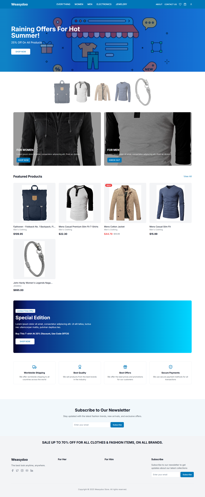
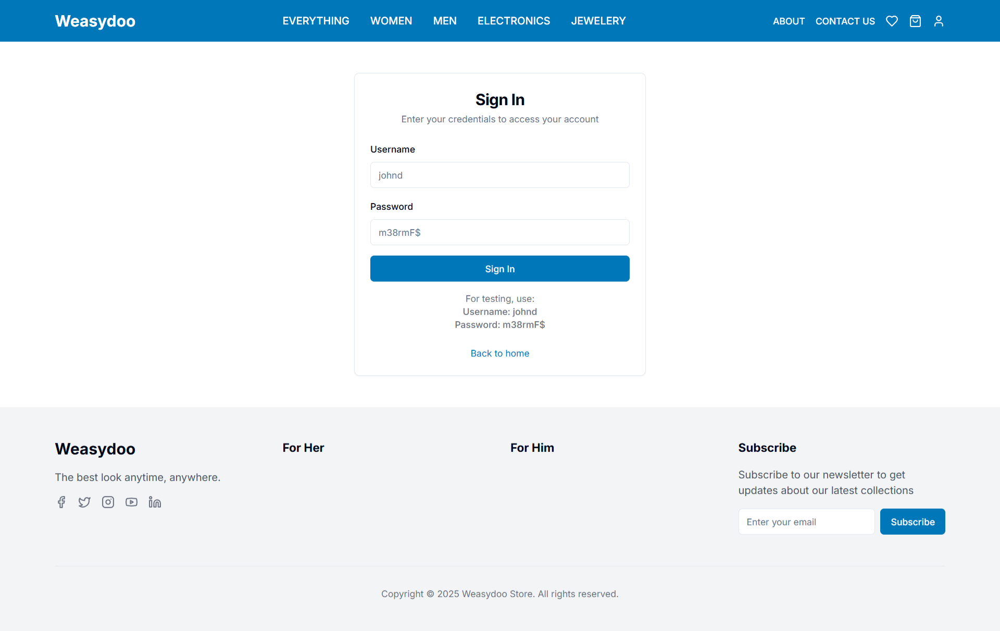
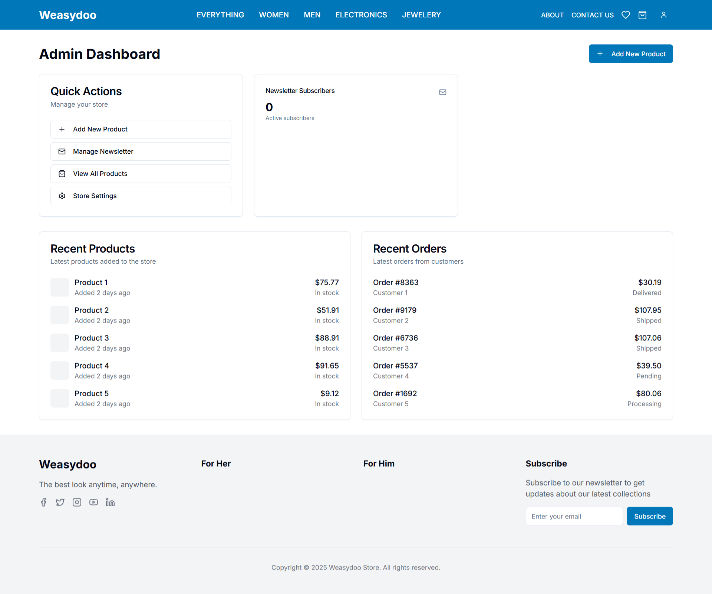
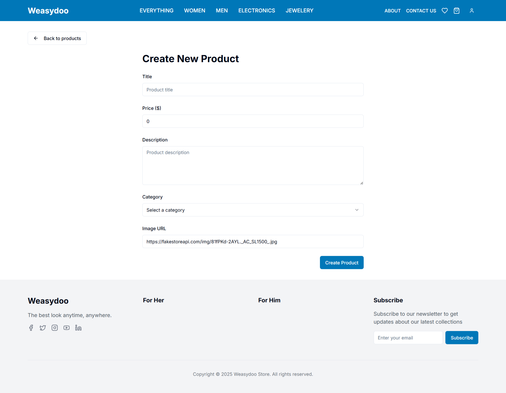
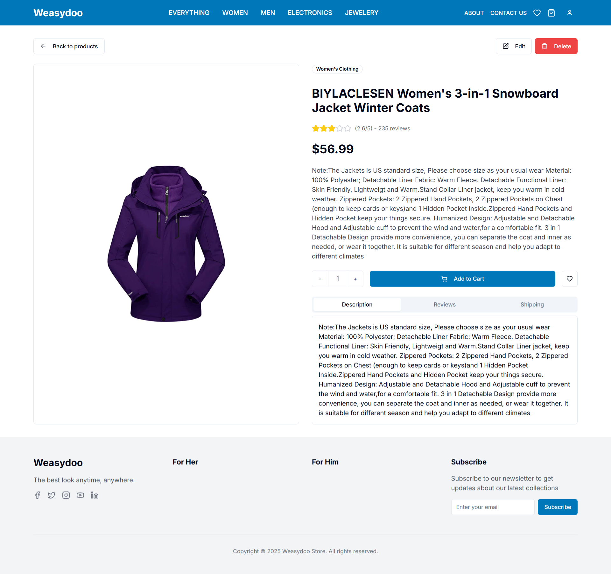
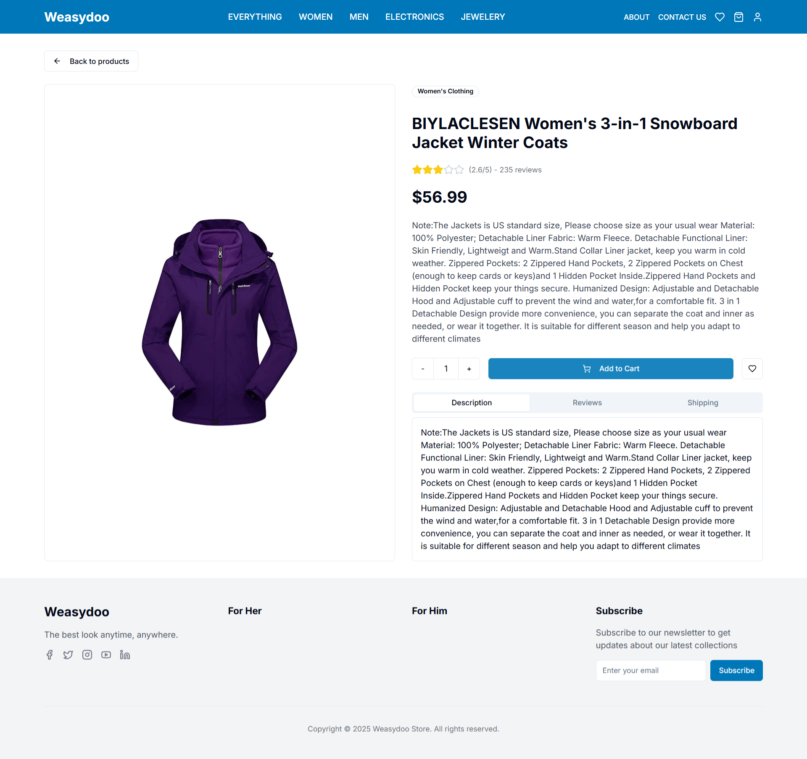

# FakeStore E-Commerce Application

A modern e-commerce application built with Next.js, featuring authentication, product management, newsletter subscription, and an admin dashboard.

## Features

### Home Page

- Hero section with featured content
- Category showcase
- Featured products section
- Sale banners
- Benefits section
- Newsletter subscription form
- Partner logos display

### Authentication System

- User login with role-based access control (Admin/Client)

- Secure token-based authentication
- Protected routes for authenticated users

- Example usage:

Admin user with fakestore-api :

const role: UserRole = userInfo.id === 1 ? "admin" : "client";

Login with username and password :
const user = await loginUser(username, password)

=>

const response = await fetch(`${API_URL}/auth/login`, {
method: "POST",
headers: {
"Content-Type": "application/json",
},
body: JSON.stringify({
username,
password,
}),
signal: AbortSignal.timeout(5000),
});

### Admin Dashboard

- Product management interface
- Newsletter subscriber management
- User management
- Analytics and statistics
- Protected admin routes
- Role-based access control

### Product Management

- Browse products with pagination
- Filter products by category
- Search functionality
- Product details view
- Admin features:
  - Create new products
  - Update existing products
  - Delete products
  - Manage product inventory

Create new Products :

Admin Product details view :

Client Product details view :

Example API calls:

// Get all products
const products = await getProducts();

// Get products by category
const categoryProducts = await getProductsByCategory("electronics");

// Create new product (admin only)
const newProduct = await createProduct(productData, authToken);

// Update product (admin only)
const updatedProduct = await updateProduct(productId, productData, authToken);

### Newsletter System

- Email subscription management
- Subscription status tracking
- Unsubscribe functionality
- Subscriber statistics
- Features:
  - Email validation
  - Duplicate subscription prevention
  - Subscription status tracking
  - Monthly subscription analytics

Example usage:

// Subscribe to newsletter
const subscriber = await subscribeToNewsletter(email);

// Unsubscribe from newsletter
await unsubscribeFromNewsletter(email);

// Get subscriber statistics
const stats = getSubscriberStats()
=>
export function getSubscribers(): NewsletterSubscriber[] {
if (typeof window === "undefined") {
return [];
}

const storedSubscribers = localStorage.getItem("newsletter_subscribers");
if (!storedSubscribers) {
return [];
}

## Technologies Used

- Next.js 13+ with App Router
- TypeScript
- Tailwind CSS
- React Context for state management
- FakeStore API for product data
- Local Storage for newsletter management
